 🩺 Doctor Appointment & Telemedicine App (Flutter) 

 A full-featured Doctor Appointment & Telemedicine application built with Flutter, using BLoC (Cubit) for state management and REST APIs for real-time data.
The system helps users browse doctors, book appointments, chat, make payments, and receive notifications — all in one place.

⚠️ This is the first version of the app and still under active development.

------
🚀 Features
👨‍⚕️ Doctor & Categories

Browse doctors by category and specialty

Search doctors by name/specialization

View detailed doctor profiles & ratings

📅 Appointments

Book, edit, or cancel appointments

Real-time appointment updates

Automatic refresh & polling

Smart schedule handling

💬 Real-Time Chat

One-to-one chat between users and doctors

Text messages + file attachments

Chat preview cards

Auto-refresh & smooth UX

📞 Calls (Telemedicine)

Voice/Video call integration (Zego SDK)

Call invitation & handling system

🔐 Authentication

Login & signup using secure REST APIs

Forgot/reset password

Update user profile & image

💳 Payments

Online payment using Paymob / Wallet

View payment history

Secure, fast checkout

🔔 Notifications

Push notifications via Firebase Cloud Messaging

Local notifications for reminders

Handles chat & appointment updates

📍 Location

Get user location

Display doctor clinics on Google Maps

🧱 Reusable UI Components

Custom input fields

Appointment cards

Message bubbles

Category carousels

Doctor cards

Date/time pickers

⚙️ App Architecture

BLoC (Cubit) state management

Repository pattern for API requests

Modular UI widgets

Clean folder structure

------
🛠 Tech Stack
Layer	Technology
Framework	Flutter / Dart
State Management	BLoC (Cubit)
Backend	PHP REST API
Database	MySQL
Local Storage	Hive / SQLite
Notifications	Firebase Cloud Messaging (FCM)
Calls	Zego Cloud
Payments	Paymob / Wallet
Location	Google Maps API
 
📸 Screenshots 

  
  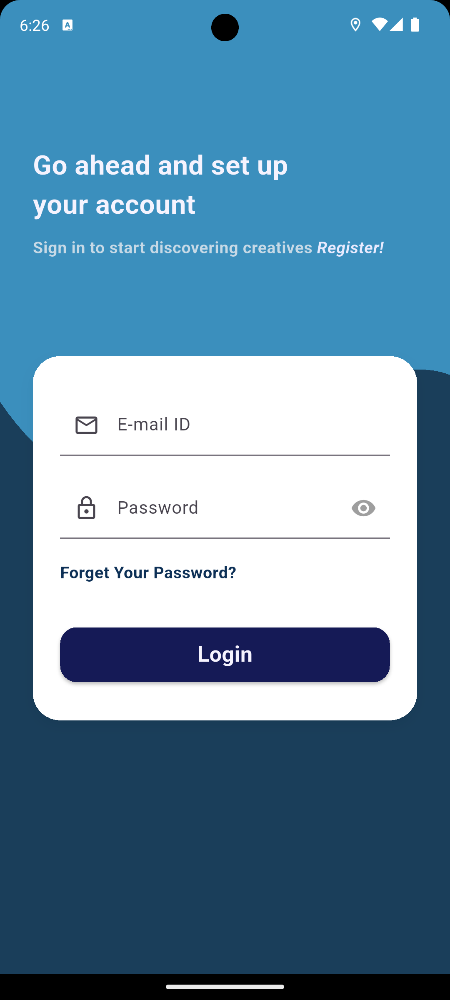
  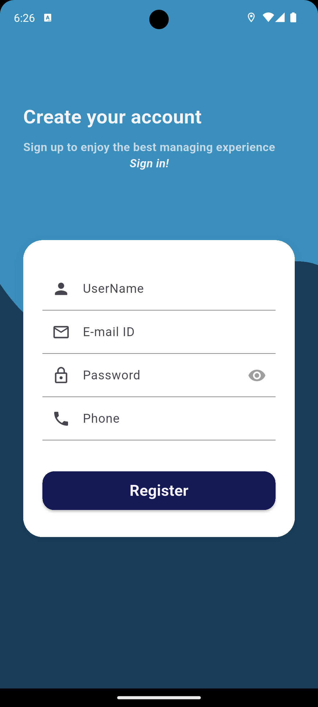
  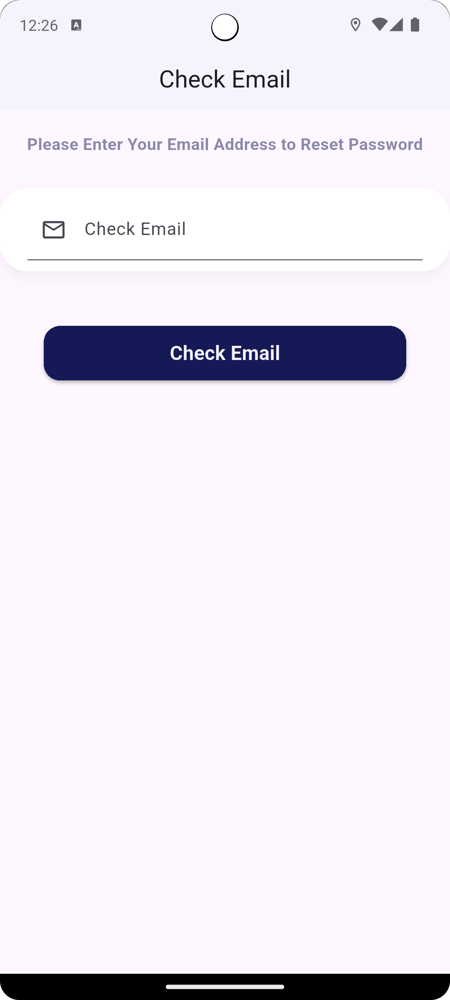
  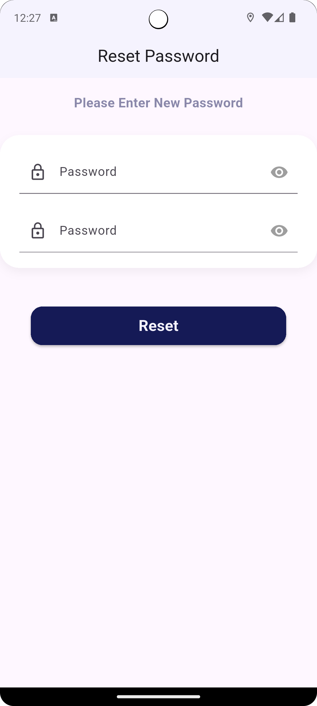
  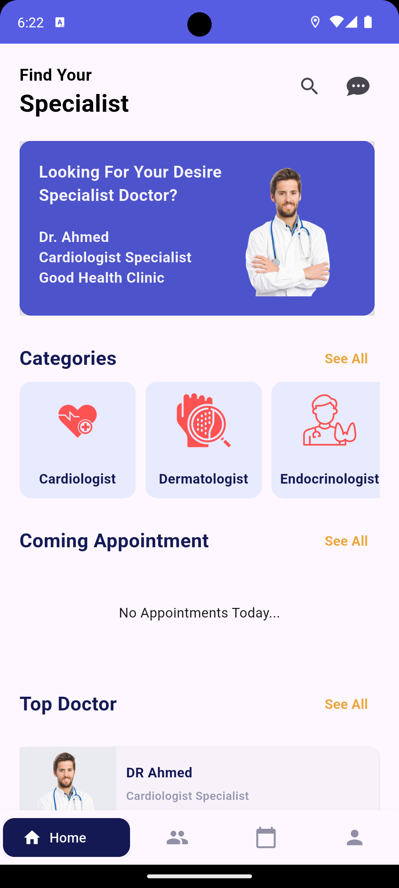
  
  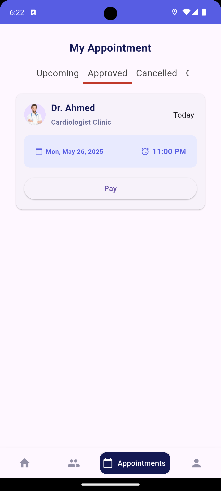
  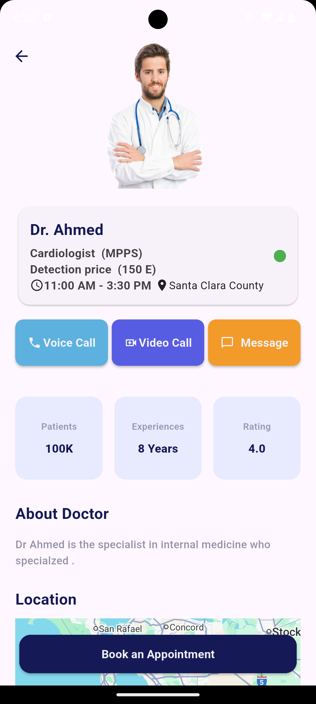
  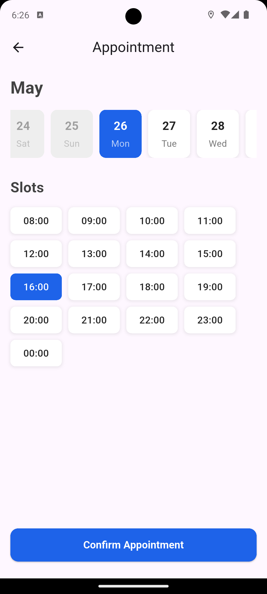
  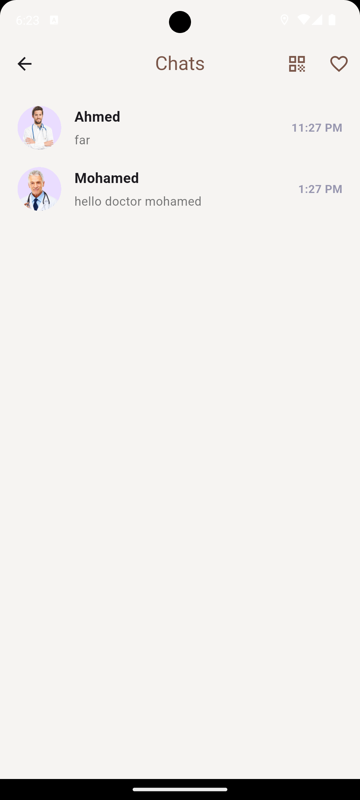
  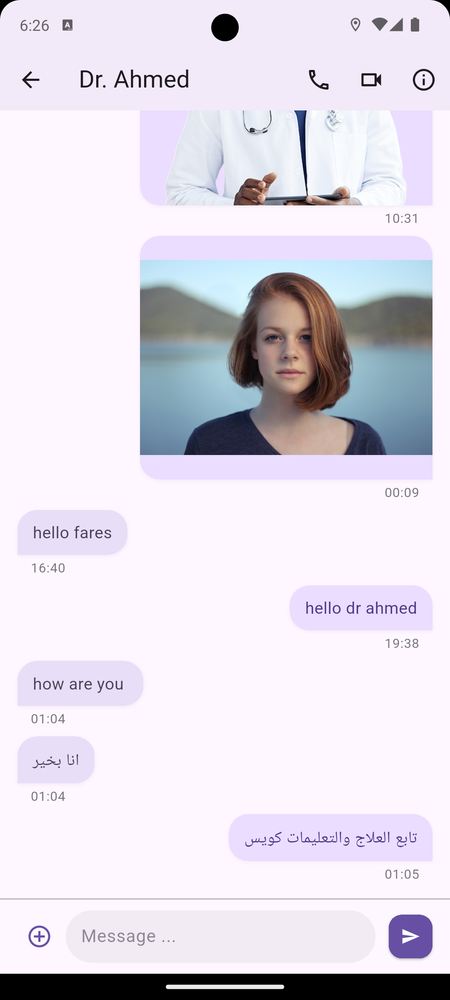
  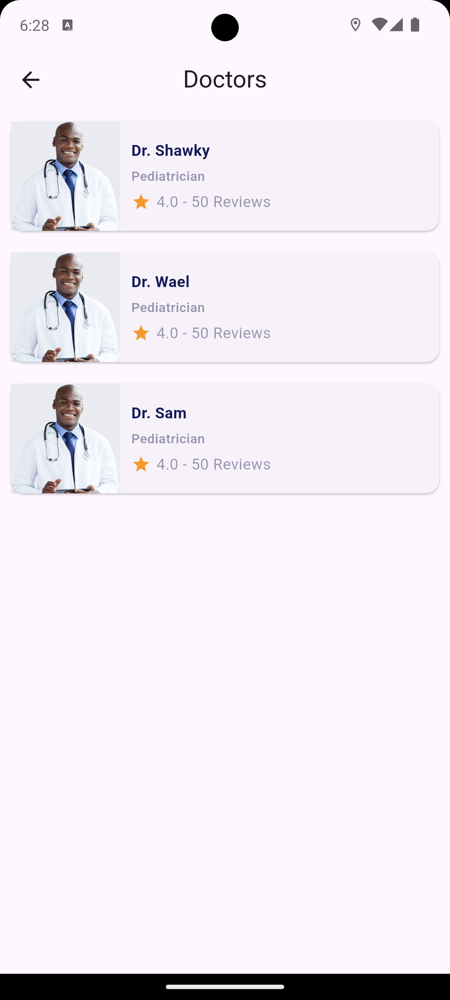
  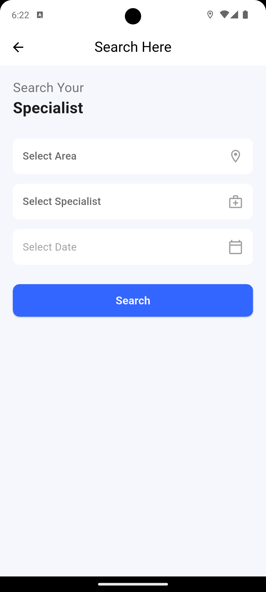
  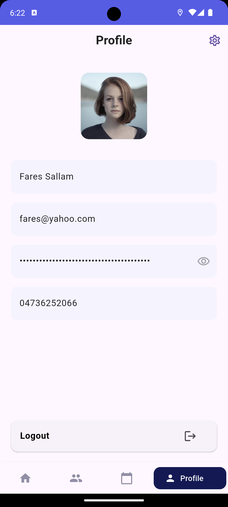
  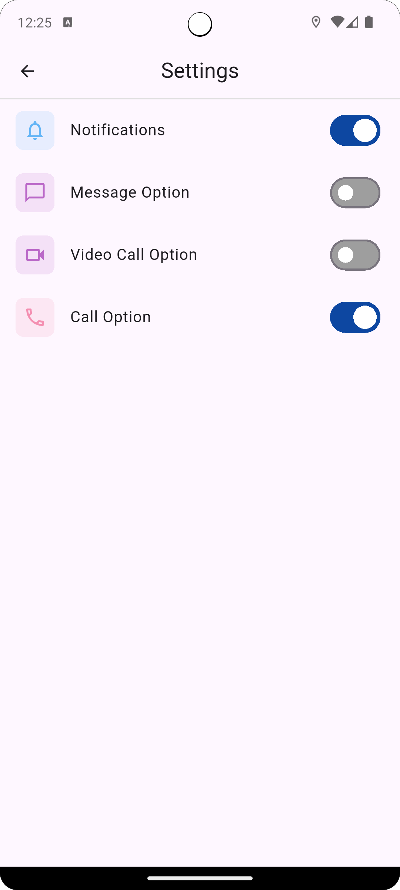
  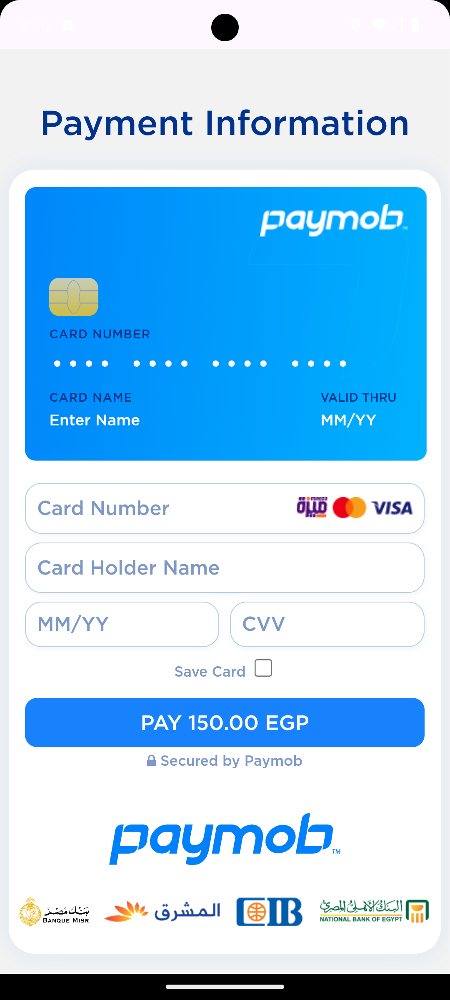

🧭 Roadmap

 Improve UI/UX

 Complete video call features

 Add dark mode

 Add doctor-side app

 Add Admin Dashboard

 Add AI assistant for medical Q&A

👨‍💻 Developer

Fares Sallam
Flutter Developer
📧 faressallam75@gmail.com

🌐 GitHub: https://github.com/FaresSallam75
